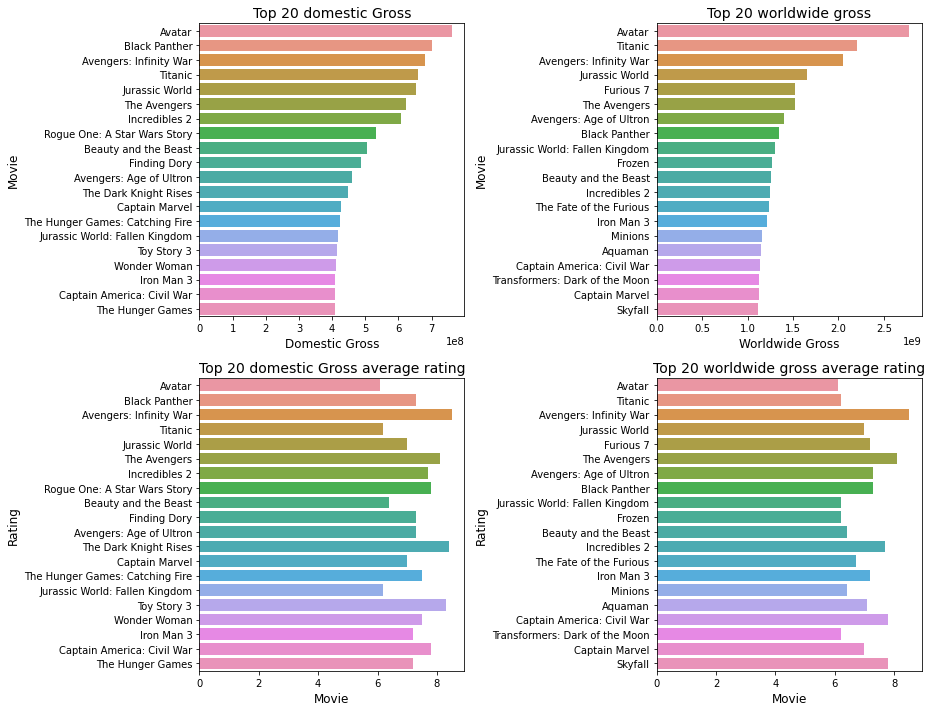

# Phase 1 Project:

# Microsoft Movie Studio: Data-Driven Decisions for Success


**Author**: Fredrick Munyao Kyeki


### Contents

- [Overview](#overview)
- [Business Problem](#businessproblem)
- [Data](#data)
- [Methods](#methods)
- [Results](#results)
- [Built with](#built-with)
- [Authors](#authors)
- [Repository Structure](#repository-structure)

## Overview
The project aims to provide data-driven insights to support Microsoft's new movie studio in establishing a successful presence in the movie industry. The business problem revolves around Microsoft's lack of expertise in film-making and the need to make informed decisions for profitable movie production. I analyzed diverse movie datasets from IMDb, Box Office Mojo, and The Numbers to answer key data questions related to movie success. By exploring top-performing films, successful genres, budget impacts, seasonal trends, audience preferences, and competition, I derived actionable recommendations for Microsoft.

The results suggest focusing on producing **Action, Adventure, Animation, Comedy, Documentary, Drama, Fantasy, Scifi, Thriller** movies with moderate budgets between **170,001,400- 255,001,400** , releasing them during peak movie-going seasons **August, December, July, June, May, November**, and creating audience-centric content that aligns with user preferences.

By leveraging data insights, Microsoft's new movie studio can strategically position itself to compete effectively and create compelling, revenue-generating films in the highly competitive movie market.

## Business Problem

Microsoft is entering the movie industry and wants to establish a successful movie studio. However, they lack expertise in the movie-making domain and need to make informed decisions to create profitable films.

The business's pain points include

uncertainty about the types of movies that perform well at the box office,
the preferences of the target audience,
and how to effectively compete in a crowded market.
The following are the data questions answered in this analysis:


***

## Data

We will use movie-related datasets from various sources, including **IMDb, Box Office Mojo, and The Numbers**. The data represent diverse movies with information on performance, ratings, genres, budgets, and revenue. Key variables include movie title, genre, budget, box office gross, user ratings, and release date.

**Data Description**:
The data used for this project comes from multiple movie-related datasets from various sources, including:

1. **IMDb (Internet Movie Database)**:
    - **IMDB Basics**:
       - Dataset: imdb.title.basics
       - Description: Contains basic movie information like **movie_id, primary_title, original_title, start_year,
         runtime_minutes, genres**
       - Relationship to Data Analysis Questions: Provides information on movie genres and basic movie details required for genre analysis.

    - **IMDb Ratings**:
       - Dataset: imdb.title.ratings
       - Description: Contains **'movie_id', 'averagerating', 'numvotes'**
       - Relationship to Data Analysis Questions: Allows us to explore audience preferences based on user ratings and reviews.

2. **Box Office Mojo**:
   - Dataset: bom.movie_gross
   - Description: Contains box office gross information for movies. \
   i.e **'title', 'studio', 'domestic_gross', 'foreign_gross', 'year'**
   - Relationship to Data Analysis Questions: Essential for analyzing box office success and financial performance of movies.

3. **The Numbers**:
   - Dataset: tn.movie_budgets
   - Description: Contains movie financials, like **'id', 'release_date', 'movie', 'production_budget', 'domestic_gross',
     'worldwide_gross'**
   - Relationship to Data Analysis Questions: Enables us to analyze the impact of movie budgets on box office revenue.

## Methods

## Data Preparation

The following describes the data cleaning process to remove any unwanted inconsistencies and operate on clean sensible data:


1. **Data Loading**: Load the required datasets, including imdb.title.basics, imdb.title.ratings, bom.movie_gross, and tn.movie_budgets, into the analysis environment.

2. **Data Cleaning**:
- Handle Missing Values: Identify and handle missing values appropriately for each dataset. Depending on the extent of missingness, we may choose to impute missing values, drop rows, or drop entire variables if they are not crucial for the analysis.
- Drop Irrelevant Variables: Remove irrelevant or redundant variables that do not contribute to the analysis questions or recommendations.
- Merge Data: Combine relevant datasets based on common keys (e.g., movie titles) to create a comprehensive dataset that includes essential movie information.

3. **Feature Engineering**:

- Calculate `Profit`: Create a new variable to calculate the profit for each movie by subtracting the budget from the box office gross. This will help us understand the financial performance of each movie.
- Calculate `foreign_gross`: from the difference between worldwide gross and domestic gross
4. **Handling Outliers**:

- Analyze and Address Outliers: Identify outliers in numeric variables like budget and box office gross. Outliers may affect our analysis, and we need to decide whether to remove or transform them based on their impact on the results.
- Consider Genre Outliers: In genre analysis, we may encounter less common or niche genres. We must decide whether to group them into broader genres or retain them as unique categories based on their significance.

The data needed for this analysis is of the following format:

| Dataset|Type
|:------|:----------|
|IMDb (Internet Movie Database) |  .db file|
|bom.movie_gross| .csv file|
|The Numbers| .csv file|


***

## Results

### 1. Interpretation of Results:

- The analysis provided valuable insights into the movie industry's performance, including popular genres, seasonal trends, and the impact of movie budget on box office revenue.
- The results identified specific genres that are currently performing well, enabling Microsoft's new movie studio to target high-demand genres.
- Seasonal trends highlighted the best months for movie releases to maximize revenue and audience ratings.
- The correlation analysis between budget and box office revenue offered valuable insights into the financial aspect of movie production.

### Findings:
**a.) What types of films are currently performing best at the box office (based on box office gross)?**



#### Top 20 best performing movies in gross returns
***
| Worldwide gross | Domestic gross |
|:----------|:----------|
| Avatar | Avatar |
| Titanic | Black Panther |
| Avengers: Infinity War | Avengers: Infinity War |
| Jurassic World | Titanic |
| Furious 7 | Jurassic World |
| The Avengers | The Avengers |
| Avengers: Age of Ultron | Incredibles 2 |
| Black Panther | Rogue One: A Star Wars Story |
| Jurassic World: Fallen Kingdom | Beauty and the Beast |
| Frozen | Finding Dory |
| Beauty and the Beast | Avengers: Age of Ultron |
| Incredibles 2 | The Dark Knight Rises |
| The Fate of the Furious | Captain Marvel |
| Iron Man 3 | The Hunger Games: Catching Fire |
| Minions | Jurassic World: Fallen Kingdom |
| Aquaman | Toy Story 3 |
| Captain America: Civil War | Wonder Woman |
| Transformers: Dark of the Moon | Iron Man 3 |
| Captain Marvel | Captain America: Civil War |
| Skyfall | The Hunger Games |

The best performing movie overall was `Avatar` with the following characteristics:
- Movie: `Avatar`
- Genres: `Horror`
- Average rating: `6.1`
- Release year: `Dec 18, 2009`
- Budget: `$425,000,000$`
- Domestic gross: `$760,507,625$`
- Worldwide gross: `$2,776,345,279$`
- Profit: `$2,351,345,279$`

.png)

 Best performing Genres in Gross returns :
| Worldwide gross| Domestic gross |
|:----------|:-----------|
| Adventure  |  Adventure |
| Sci-Fi  |  Sci-Fi |
| Romance  |  Romance |
| Drama  |  Drama |
| Thriller  |  Fantasy |
| Horror  |  Horror |
| Fantasy  |  Thriller |
| Animation  |  Animation |
| Action  |  Action |
| Sport  |  Comedy |
| Comedy  |  __ |
| Crime  |  __ |

### Top 5 best performing genres in terms of gross are:
- Worldwide gross
    ```
    - Adventure
    - Action
    - Scifi
    - Thriller
    - Drama
    ```
- Domestic gross
    ```
    - Adventure
    - Action
    - Scifi
    - Animation
    - Fantasy
    ```

**b.) Which movie genres have been the most popular and successful over time?**

.png)

The top 5 most popular (highly rated yearly / most loved) genres are
- Drama
- Action
- Documentary
- Adventure
- Comedy

**c.) How does the movie budget impact box office revenue, and can smaller budget films be profitable?**


- A correlation coefficient of approximately **0.78** between `production_budget` and
`worldwide_gross` indicates a **strong positive linear correlation**.
.png)
- This means that there is a significant and positive relationship between the movie's production budget and its worldwide box office revenue.
- The optimal budget range is: $170,001,400$ - $255,001,400$
.png)


- The **correlation coefficient** of approximately **0.66** between `profitability` and
.png)

`production budget` indicates a **moderately positive linear correlation**.
- This means that there is a positive relationship between a movie's production budget and its profitability.

**d.) Are there seasonal trends in movie performance, and when is the best time to release a movie?**

- **Months with Higher Average Worldwide Gross:**

    - **June (Jun)** has the highest average worldwide gross among all months, followed closely by **May (May)** and **December (Dec)**.
    - These months could be considered the best time to release a movie for maximum revenue, as they tend to generate higher box office gross on average.
.png)

- **Months with Higher Average Rating:**

    - **November (Nov)** has the highest average rating among all months, followed by **June (Jun)** and **May (May)**.
    - **November** seems to be a favorable month for releasing movies that receive higher audience ratings on average.

- **Seasonal Patterns:**
    - Summer months ***(June, July, and August)*** show *strong performance* in terms of both average worldwide gross and
    average rating.
    - This could be due to the summer vacation period and increased movie going during this time.
    - **December**, being the holiday season, also exhibits high average worldwide gross and average rating, making it
    a potential lucrative period for movie releases.
***
## Recommendations for the Business:

   Based on the analysis conducted, the following recommendations are made for Microsoft's new movie studio:

   a.) **Focus on Popular Genres**: Allocate resources to produce movies in genres that are currently performing well based on box office gross and audience ratings. This can increase the likelihood of commercial success and positive audience reception.

   - The genres that are likely to perform well are:
     - Action
     - Adventure
     - Animation
     - Comedy
     - Documentary
     - Drama
     - Fantasy
     - Scifi
     - Thriller


   b.) **Optimize Release Timing**: Use the insights from seasonal trends to strategically plan movie releases. Target months with historically higher average worldwide gross and audience ratings to maximize revenue and audience reach.

   - The best months of release are:
       - August
       - December
       - July
       - June
       - May
       - November

   c.) **Budget Allocation**: Analyze the relationship between movie budgets and box office revenue to make informed decisions about budget allocation for different movie projects. This can help optimize resources and manage financial risks.

       - The safest budget range is: $170,001,400$ - $255,001,400$,  with the highest profitability index (**96.96%**).
***
Other Recommendations:
***
   d.) **Emphasize Audience Preferences**: Analyze user ratings and reviews to understand audience preferences and align movie production with content that resonates well with the target audience.

   e.) **Collaborate with Industry Experts**: Engage with industry experts and professionals to complement data-driven insights with creative expertise and market knowledge, ensuring a well-rounded approach to movie production.

## Limitations of the Analysis:
   While the analysis provides valuable insights, certain limitations should be considered:

   a.) **Data Quality**: The accuracy and completeness of the analysis depend on the quality of the data used. Incomplete or biased data could impact the reliability of the results.

   b.) **External Factors**: The movie industry is influenced by various external factors, such as competitor strategies, economic conditions, and cultural events, which are not directly captured in the analysis.

   c.) **Subjective Nature**: Movie success involves subjective elements such as artistic creativity, storytelling, and audience emotional connection, which cannot be fully captured through data analysis alone.

## Future Improvements:
   To enhance the project in the future, consider the following:

   a.) **Validation and Testing**: Validate the analysis results using external datasets or real-world performance. Testing the model on a separate hold-out dataset can help assess its generalizability.

   b.) **Incorporate Audience Sentiment Analysis**: Analyze audience sentiments and reviews using natural language processing techniques to gain deeper insights into audience preferences and reactions.

   c.) **Market Research**: Conduct market research and audience surveys to complement data analysis and gather qualitative feedback on movie preferences and expectations.

   d.) **Continuous Monitoring**: Continuously monitor movie performance and audience reactions to adapt strategies and improve decision-making based on real-time data.

   e.) **Expand Data Sources**: Consider incorporating data from other reliable sources, such as audience demographics and social media trends, to gain a comprehensive understanding of the target audience.


## Built with :gear:
- python3 (3.8.5)
- conda 4.10.3

### Authors :fountain_pen:
* [Fredrick Kyeki](https://github.com/FREDRICKKYEKI) - @FREDRICKKYEKI

## Repository Structure

Describe the structure of your repository and its contents, for example:

```
├── README.md                           <- The top-level README for reviewers of this project
├── student.ipynb   <- Narrative documentation of analysis in Jupyter notebook
├── presentation.pdf         <- PDF version of project presentation
├── data                                <- Both sourced externally and generated from code
└── images                   <- Both sourced externally and generated from code
```
